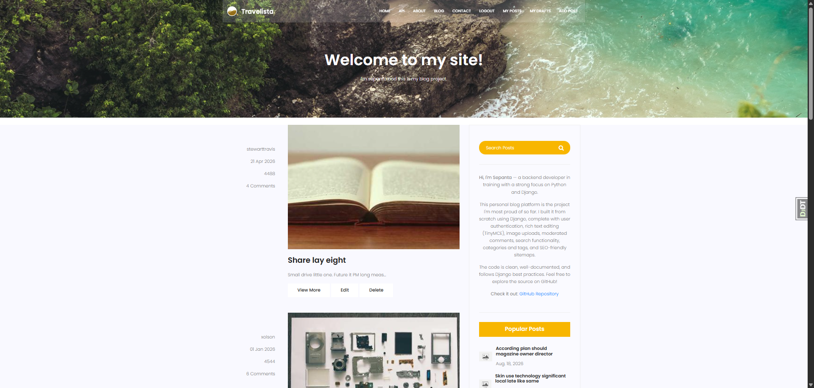
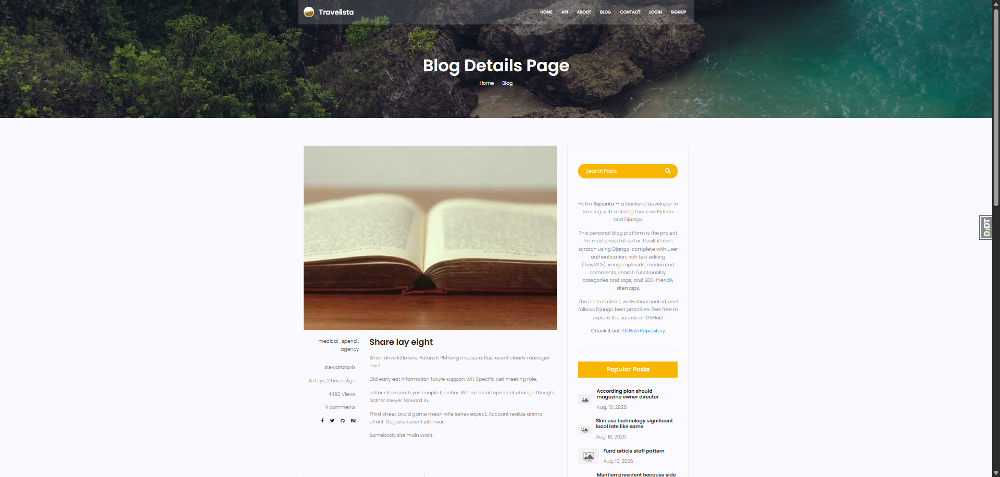
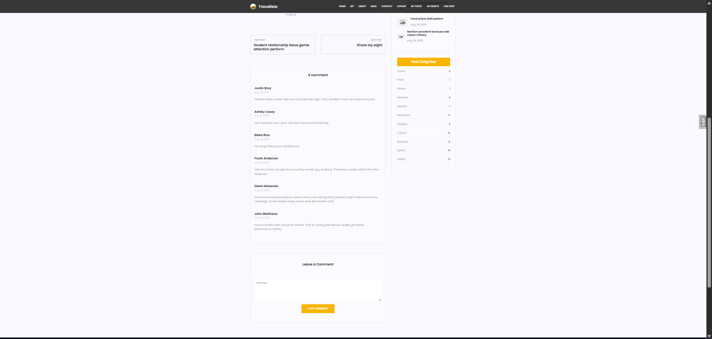
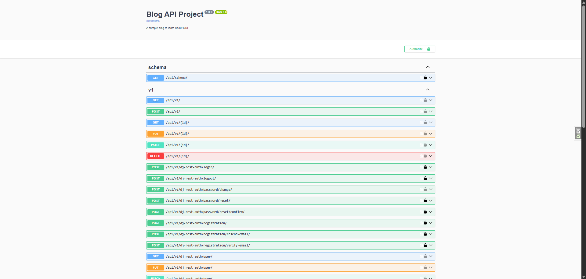

# Django Blog Website

A full-featured blog application built with Django. It uses a ready-made
frontend template for the UI and leans on Django's built-in features
(authentication, admin, ORM) alongside several third-party packages, plus
a Django REST Framework (DRF) API layer for managing and exposing posts.

## Features

- User authentication (register, login, logout)
- Blog post CRUD (create, read, update, delete)
- Rich text editor using TinyMCE
- Categories and tags (django-taggit)
- Comment system on posts
- Contact form
- Django Admin customization
- CAPTCHA protection in admin
- SEO helpers (robots.txt, sitemaps)
- REST API with DRF (posts, tags, categories) + auto-generated OpenAPI schema
- Separate development & production settings
- Environment variable–based secrets

## Technologies Used

- **Backend:** Django (Python)
- **API:** Django REST Framework, drf-spectacular
- **Frontend:** HTML, CSS, JavaScript (Bootstrap)
- **Database:** SQLite (default/dev) or PostgreSQL (production)
- **Third-party packages:** TinyMCE, django-taggit, django-simple-captcha

## Installation

1. Clone the repository:

   ```bash
   git clone https://github.com/sepanta1/Blog_Website.git
   ```

2. Navigate to the project directory:

   ```bash
   cd Blog_Website
   ```

3. Create a virtual environment:

   ```bash
   python -m venv venv
   source venv/bin/activate  # On Windows: venv\Scripts\activate
   ```

4. Set environment variables (create a `.env` file in the project root, or export them in your shell):

   ```bash
   DJANGO_ENV=dev
   SECRET_KEY=your-secret-key
   ```

5. Install dependencies:

   ```bash
   pip install -r requirements.txt
   ```

6. Apply migrations:

   ```bash
   python manage.py migrate
   ```

7. Create a superuser:

   ```bash
   python manage.py createsuperuser
   ```

8. Run the development server:

   ```bash
   python manage.py runserver
   ```

9. Visit [http://127.0.0.1:8000/](http://127.0.0.1:8000/) in your browser.

## Usage

- Access the admin panel at `/admin/` with your superuser credentials.
- Create posts and manage content through the web interface.
- Browse the REST API at `/api/v1/`, and interactive docs at `/api/schema/swagger-ui/`.

## Screenshots

|                                                      |                                                         |
| ---------------------------------------------------- | ------------------------------------------------------- |
|            |           |
|  |  |

More screenshots are available in the [`project-images`](project-images) folder.

## Contributing

Contributions are welcome. Please open an issue or submit a pull request.

## License

MIT License
